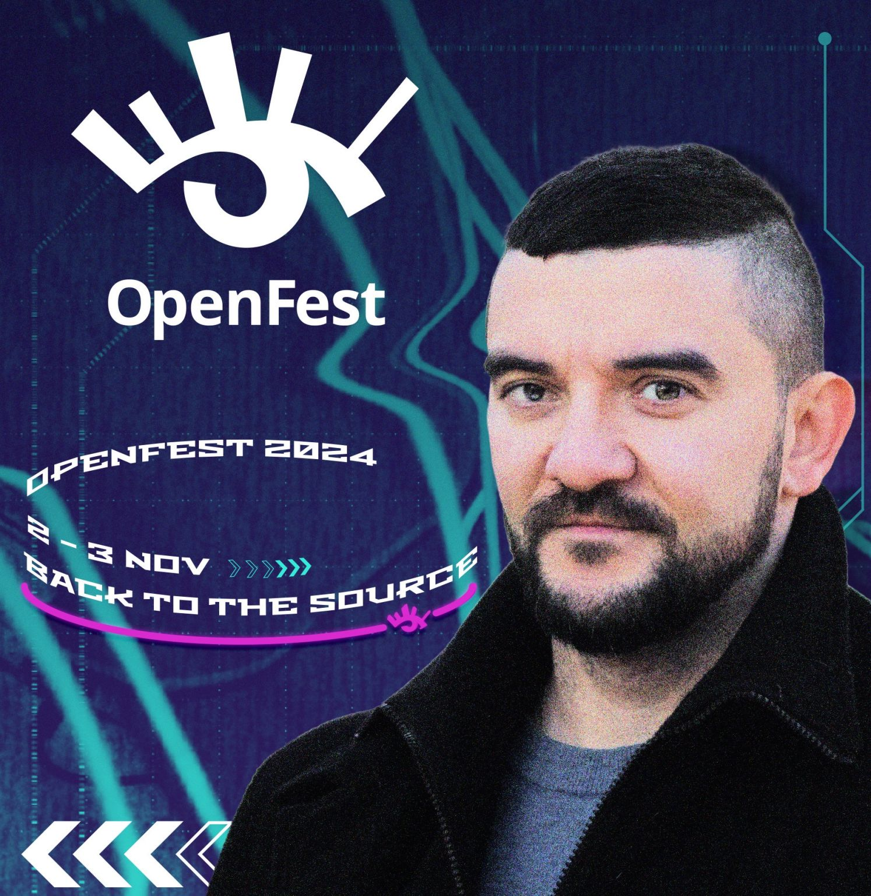

# OpenFest 2024 hands-on workshop: Chaos Challenge: Kubernetes Containerization Live with You!

This is a Hands-on workshop for OpenFest 2024. The workshop is about Chaos Engineering and Kubernetes. We will be using a simple application to demonstrate how to containerize an application and deploy it on Kubernetes. We will also demonstrate how to inject chaos into the application to test its resilience.

At the end we will play games and try to kill our application. Let's see if we can achieve that ...

## Introduction

Inside demo folder you will find our Hands-on
